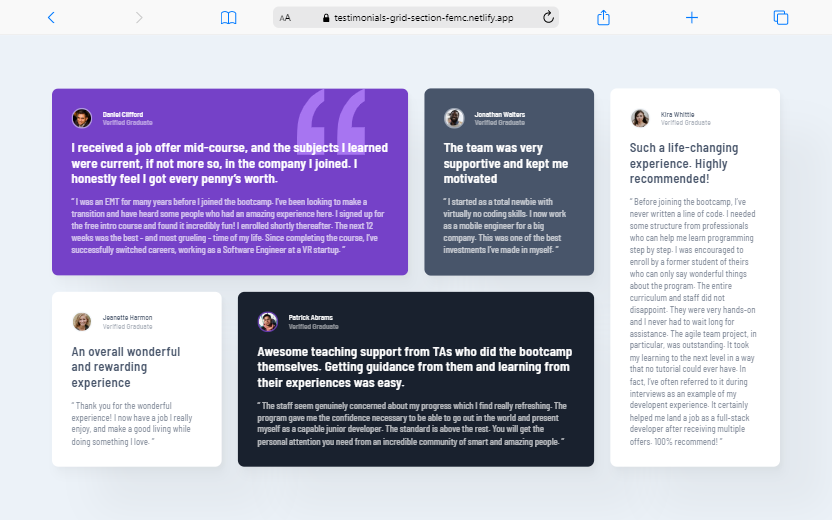
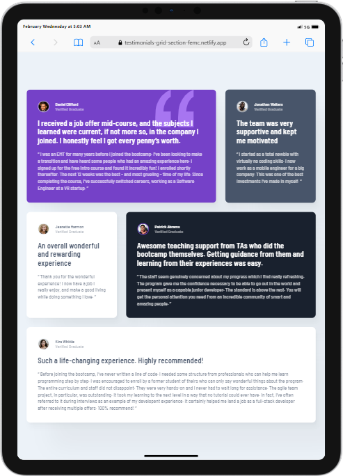
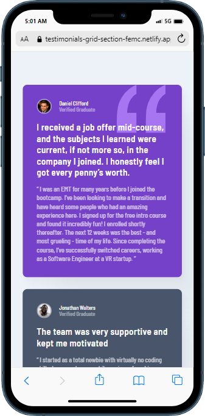

# Frontend Mentor - Testimonials grid section solution

This is a solution to the [Testimonials grid section challenge on Frontend Mentor](https://www.frontendmentor.io/challenges/testimonials-grid-section-Nnw6J7Un7).

## Table of contents

- [Overview](#overview)
  - [The challenge](#the-challenge)
  - [Screenshot](#screenshot)
  - [Links](#links)
- [My process](#my-process)
  - [Built with](#built-with)
  - [What I learned](#what-i-learned)
  - [Continued development](#continued-development)
  - [Useful resources](#useful-resources)
- [Author](#author)
- [Acknowledgments](#acknowledgments)

**Note: Delete this note and update the table of contents based on what sections you keep.**

## Overview

### The challenge

Users should be able to:

- View the optimal layout for the site depending on their device's screen size

### Screenshot






### Links

- Solution URL: [Click here](https://www.frontendmentor.io/solutions/responsive-testimonials-grid-section-keCmIuQfAJ)
- Live Site URL: [Click here](https://testimonials-grid-section-femc.netlify.app/)

## My process

### Built with

- Semantic HTML5 markup
- Flexbox
- CSS Grid
- Mobile-first workflow


### What I learned

I was another day to practice the use of ```display: grid``` :)

### Continued development

I'd love to add animations to this project in the near future!

### Useful resources

- [Philipp Brumm's smooth shadow tool](https://shadows.brumm.af/)
- [A Complete Guide to CSS Grid](https://css-tricks.com/snippets/css/complete-guide-grid/)
- [CSS background Property](https://www.w3schools.com/cssref/css3_pr_background.php)


## Author

- Frontend Mentor - [@xyzeez](https://www.frontendmentor.io/profile/xyzeez)
- Twitter - [@abdusamii_](https://twitter.com/abdusamii_)

## Acknowledgments

- [@MelvinAguilar's submission](https://www.frontendmentor.io/solutions/testimonials-grid-section-sass-responsive-grid-layout-P1LwWmdpaG) : This helped me understand some acpect of the project as I try to make it as similar as possible and I found this solution on point.

